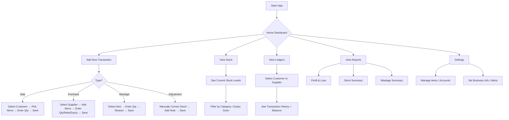
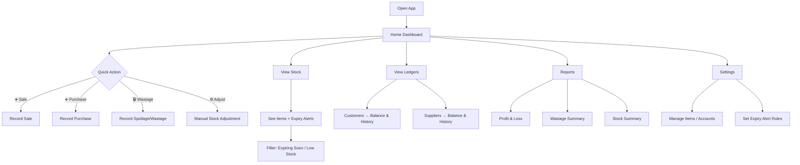

### USER
i want to you plan the user flow it make sense

### ASSISTANT
Absolutely! Based on your **offline-first retail billing + accounting + inventory system**—optimized for **home/small shop use with perishable goods**—here’s a clean, logical **user flow** that aligns with real-world daily operations and your technical design.

---

## 🧭 OVERALL USER GOAL
> **Record daily business activity (sales, purchases, wastage) → Track stock → View ledgers & reports → Make informed decisions**

All while staying **simple**, **offline**, and **perishable-aware**.

---

## 🗺️ HIGH-LEVEL USER FLOW (Daily Operator Journey)



---

## 🧱 DETAILED SCREEN-BY-SCREEN USER FLOW

### 1. **Onboarding / First Launch (One-time)**
- Set business name, currency, fiscal year (via `BusinessConfig`)
- Optional: Enable expiry alerts, set default valuation method

---

### 2. **Home Dashboard (Default Screen)**
Shows at-a-glance:
- Today’s sales & purchases
- Low stock items (≤ reorder level)
- Items expiring in next 1–2 days
- Quick buttons:
  - ➕ New Sale
  - ➕ New Purchase
  - 🗑️ Record Wastage
  - 📊 View Stock
  - 📑 Ledgers
  - 📈 Reports

---

### 3. **Record a Sale**
1. Tap **“New Sale”**
2. Choose **Customer** (or “Cash” for walk-in)
   - If new → quick add (name only; profile optional)
3. Add items:
   - Search or scan (future)
   - Enter quantity
   - System auto-fills rate (from last purchase or avg)
4. Review total
5. Save → creates:
   - `Transaction(type: sale)`
   - `TransactionEntry` (Customer/Cash ↔ Sales)
   - `StockMovement(direction: out)`

> 💡 If item is out of stock → warning

---

### 4. **Record a Purchase**
1. Tap **“New Purchase”**
2. Choose **Supplier** (or add new)
3. Add items:
   - Select from list
   - Enter **quantity**, **rate**, **expiry date** (or auto-calc from `shelf_life_days`)
   - Optional: batch number
4. Save → creates:
   - `Transaction(type: purchase)`
   - `TransactionEntry` (Inventory ↔ Supplier/Cash)
   - `StockMovement(direction: in)` with expiry
   - Updates item’s `avg_rate`

---

### 5. **Record Wastage (Critical for Perishables)**
1. Tap **“Record Wastage”**
2. Select item (only items with stock > 0)
3. Enter:
   - Quantity wasted
   - Reason (spoiled, broken, expired)
   - Date (defaults to today)
4. Save → creates:
   - `Transaction(type: wastage)`
   - `TransactionEntry`:  
     - Debit: “Wastage Expense”  
     - Credit: “Inventory”
   - `StockMovement(direction: waste)`

> 📌 This reduces stock **and** hits P&L — accurate for perishables.

---

### 6. **View Stock**
- List of all items
- Columns: Name | Unit | Current Qty | Avg Rate | Expiry (nearest) | Reorder?
- Filters:
  - By category (Dairy, Fruits…)
  - “Expiring Soon” (next 48 hrs)
  - “Low Stock”
- Tap item → see batch-wise breakdown (if batches enabled)

---

### 7. **View Customer/Supplier Ledger**
1. Go to **Ledgers**
2. Choose **Customers** or **Suppliers**
3. See list with current balance
4. Tap any → view full transaction history:
   - Date | Narration | Debit | Credit | Running Balance

> Powered by `TransactionEntry` + `Transaction` join.

---

### 8. **Reports (Read-only, Auto-generated)**
- **Profit & Loss**:  
  `Sales – COGS – Expenses (incl. wastage)`
- **Stock Summary**:  
  Item | Opening | In | Out | Waste | Closing | Value
- **Wastage Report**:  
  Daily/Weekly loss by item/category
- **Expiry Alert**:  
  Items expiring in next N days

> All computed from core tables — no manual entry.

---

### 9. **Settings & Maintenance**
- **Manage Items**: Add/edit (name, unit, shelf life, category)
- **Manage Accounts**: Add customers/suppliers
- **Business Config**: Update shop name, alert rules
- **Backup**: Export DB (future: auto-cloud sync placeholder)

---

## 🔁 DAILY OPERATOR CYCLE (Realistic Routine)

| Time        | Action                          | System Impact                     |
|-------------|----------------------------------|-----------------------------------|
| Morning     | Check expiry alerts              | View `ExpiryAlert` screen         |
|             | Record yesterday’s wastage       | Create `wastage` transaction      |
| Midday      | Record sales                     | `sale` + stock out                |
| Afternoon   | Receive new stock (milk, veggies)| `purchase` + stock in + expiry    |
| Evening     | Review P&L & stock levels        | View reports                      |
| Weekly      | Reconcile supplier payments      | Use ledger to check dues          |

---

## ✅ WHY THIS FLOW WORKS FOR YOUR USE CASE

- **Perishable-first**: Wastage & expiry are **first-class actions**, not afterthoughts.
- **Offline-native**: No internet needed at any step.
- **Accounting-integrated**: Every action updates both **inventory** and **books**.
- **Scalable**: Sync, multi-user, barcode can be added later without redesign.
- **Simple UI**: Only 5–6 core screens; no complex menus.

---

Would you like a **wireframe sketch** (text-based) of each screen’s layout next? Or the **Drift schema** to start coding this flow?

### USER
yes

### ASSISTANT
Perfect! Based on your full context — **offline-first**, **home/small shop use**, **perishable goods focus**, and **double-entry accounting + inventory** — here’s a **clean, logical user flow** that makes real-world sense and aligns with your data model.

---

## 🧭 OVERALL USER GOAL  
> **Record daily activity → Track stock (with expiry) → See who owes what → Understand profit/loss**

All while staying **simple**, **offline**, and **perishable-aware**.

---

## 🗺️ HIGH-LEVEL USER FLOW



---

## 🧱 DETAILED SCREEN FLOW (Daily Use)

### 1. **Home Dashboard** *(Default Screen)*
- Shows:
  - Today’s sales & purchases
  - **Expiring soon** items (next 1–2 days)
  - **Low stock** items (≤ reorder level)
  - Quick buttons: Sale, Purchase, Wastage
- No login, no internet — just open and go.

---

### 2. **Record a Sale**
1. Tap **“New Sale”**
2. Choose **Customer** (or “Cash”)
3. Add items:
   - Pick from list
   - Enter quantity
   - System uses **current avg rate** (or last purchase rate)
4. Save → creates:
   - `Transaction(type: sale)`
   - `TransactionEntry`: Cash/Receivable ↔ Sales
   - `StockMovement(direction: out)`

> ❗ If item is out of stock → warning  
> ❗ If item expired → block or warn

---

### 3. **Record a Purchase** *(e.g., milk delivery)*
1. Tap **“New Purchase”**
2. Choose **Supplier**
3. Add items:
   - Select item (e.g., “Toned Milk 1L”)
   - Enter **qty**, **rate**, **expiry date**  
     *(or auto-calculate expiry = today + shelf_life_days)*
4. Save → creates:
   - `Transaction(type: purchase)`
   - `TransactionEntry`: Inventory ↔ Supplier/Payable
   - `StockMovement(direction: in, expiry_date: …)`
   - Updates item’s `avg_rate`

---

### 4. **Record Wastage** *(Critical for perishables)*
1. Tap **“Record Wastage”**
2. Select item (only if stock > 0)
3. Enter:
   - Quantity wasted
   - Reason (e.g., “spoiled”, “expired”, “spilled”)
4. Save → creates:
   - `Transaction(type: wastage)`
   - `TransactionEntry`:  
     - Debit: “Wastage Expense”  
     - Credit: “Inventory”
   - `StockMovement(direction: waste)`

> ✅ This reduces stock **and** hits P&L — accurate for daily loss tracking.

---

### 5. **View Stock**
- List of all items with:
  - Current quantity
  - Nearest expiry date
  - Reorder level indicator
- Filters:
  - “Expiring in 1 day”
  - “Expiring in 2 days”
  - “Low stock”
- Tap item → see batch-wise stock (if batches enabled)

---

### 6. **View Customer/Supplier Ledger**
- **Customer Ledger**: Shows all sales, payments, balance due
- **Supplier Ledger**: Shows purchases, payments made, amount owed
- Each entry shows:
  - Date
  - Narration (e.g., “Sale #2001”)
  - Debit / Credit
  - Running balance

> Powered by `TransactionEntry` joined with `Transaction`.

---

### 7. **Reports (Auto-generated)**
- **Profit & Loss**:  
  `Sales – (COGS + Wastage + Other Expenses)`
- **Wastage Report**:  
  Daily loss by item (e.g., “Milk: ₹120 wasted this week”)
- **Stock Summary**:  
  Closing stock value, items expiring soon
- **Expiry Alert List**:  
  Auto-generated list for next 48 hours

> All computed from core tables — no manual input.

---

### 8. **Settings**
- **Manage Items**: Add/edit (name, unit, shelf_life, reorder level)
- **Manage Accounts**: Add customers/suppliers
- **Business Info**: Shop name, currency
- **Alert Rules**: “Warn 1 day before expiry”

> Optional future: Enable sync, backup, cloud

---

## 🔁 REALISTIC DAILY OPERATOR CYCLE (Home/Small Shop)

| Time        | Action                                  | System Impact                          |
|-------------|-----------------------------------------|----------------------------------------|
| **Morning** | Check **Expiry Alerts**                 | See what’s spoiling today              |
|             | Record **yesterday’s wastage**          | Reduce stock, log expense              |
| **Midday**  | Record **sales**                        | Stock out, update receivables          |
| **Evening** | Receive **new stock** (milk, veggies)   | Stock in + expiry, update avg cost     |
| **Weekly**  | Review **P&L** and **supplier dues**    | Decide restocking, check wastage trend |

---

## ✅ WHY THIS FLOW WORKS FOR YOU

- **Perishable-first**: Wastage and expiry are **core actions**, not edge cases.
- **Offline-native**: Zero dependency on internet.
- **Accounting-integrated**: Every stock move has a financial impact.
- **Simple mental model**: One screen per task, no nested menus.
- **Sync-ready**: All tables include placeholders (`uuid`, `isSynced`) for future cloud.

---

Would you like the next step to be:
1. **Drift schema files** (for `Item`, `StockMovement`, `Transaction`, etc.) with perishable fields?
2. Or a **text-based wireframe** of each screen layout?

Let me know!

### USER
create a text-based wireframe of each screen layout

### ASSISTANT
Absolutely! Below is a **text-based wireframe** for each core screen in your **offline-first retail billing app for perishable goods**, designed for **home/small shop use**.  
Each layout is **minimal**, **task-focused**, and aligned with your data model (Accounts + Inventory + Double-entry + Wastage).

---

### 🏠 1. **Home Dashboard**  
*(Default screen on app open)*

```
┌──────────────────────────────────────┐
│ 🏪 My Dairy Shop       📅 16 Oct 2025 │
├──────────────────────────────────────┤
│ 📉 TODAY AT A GLANCE                 │
│ • Sales: ₹1,240                      │
│ • Purchases: ₹800                    │
│ • Wastage: ₹60                       │
│                                      │
│ ⚠️ EXPIRING SOON (2)                 │
│ • Toned Milk 1L → 2L (expires today) │
│ • Curd 500g → 3 packs (tomorrow)     │
│                                      │
│ 📦 LOW STOCK (1)                     │
│ • Paneer → 0.2 kg (reorder <1kg)     │
├──────────────────────────────────────┤
│ [➕ New Sale]    [➕ New Purchase]    │
│ [🗑️ Wastage]    [📊 View Stock]      │
│ [📑 Ledgers]    [📈 Reports]         │
└──────────────────────────────────────┘
```

> ✅ **Purpose**: Quick overview + one-tap actions.

---

### 💰 2. **Record Sale Screen**

```
┌──────────────────────────────────────┐
│ 🧾 New Sale                          │
├──────────────────────────────────────┤
│ Customer: [Ramesh ▼]                 │
│ (or tap “+” to add new)              │
│                                      │
│ ITEMS                                │
│ ┌────────────────────────────────┐   │
│ │ Toned Milk 1L        ₹60       │   │
│ │ Qty: [2]                       │   │
│ │ Subtotal: ₹120                 │   │
│ └────────────────────────────────┘   │
│                                      │
│ [ + Add Item ]                       │
│                                      │
│ TOTAL: ₹120                          │
│                                      │
│ [ Save Sale ]                        │
└──────────────────────────────────────┘
```

> ✅ **Logic**:  
> - Auto-fills rate from item’s `avg_rate`  
> - On save: creates `Transaction(type: sale)`, `TransactionEntry`, `StockMovement(direction: out)`

---

### 📦 3. **Record Purchase Screen**

```
┌──────────────────────────────────────┐
│ 📥 New Purchase                      │
├──────────────────────────────────────┤
│ Supplier: [Dairy Co. ▼]              │
│ (or tap “+” to add new)              │
│                                      │
│ ITEMS                                │
│ ┌────────────────────────────────┐   │
│ │ Toned Milk 1L                  │   │
│ │ Qty: [10]                      │   │
│ │ Rate: ₹58                      │   │
│ │ Expiry: [18 Oct 2025 ▼]        │   │
│ │ (or auto: today + 3 days)      │   │
│ │ Total: ₹580                    │   │
│ └────────────────────────────────┘   │
│                                      │
│ [ + Add Item ]                       │
│                                      │
│ GRAND TOTAL: ₹580                    │
│                                      │
│ [ Save Purchase ]                    │
└──────────────────────────────────────┘
```

> ✅ **Logic**:  
> - `shelf_life_days` → auto-suggest expiry  
> - Updates item’s `avg_rate` and stock

---

### 🗑️ 4. **Record Wastage Screen** *(Critical for perishables)*

```
┌──────────────────────────────────────┐
│ 🗑️ Record Wastage                   │
├──────────────────────────────────────┤
│ Item: [Toned Milk 1L ▼]              │
│                                      │
│ Qty Wasted: [1.5]                    │
│                                      │
│ Reason:                              │
│ ( ) Expired                          │
│ (●) Spoiled                          │
│ ( ) Spilled                          │
│ ( ) Other: [__________]              │
│                                      │
│ Note: [Milk turned sour]             │
│                                      │
│ Estimated Loss: ₹87                  │
│                                      │
│ [ Save Wastage ]                     │
└──────────────────────────────────────┘
```

> ✅ **Logic**:  
> - Creates `Transaction(type: wastage)`  
> - Debits “Wastage Expense”, Credits “Inventory”  
> - Reduces stock via `StockMovement(direction: waste)`

---

### 📊 5. **Stock Screen**

```
┌──────────────────────────────────────┐
│ 📦 Current Stock                     │
├──────────────────────────────────────┤
│ 🔍 [Search items...]                 │
│ [Expiring Soon] [Low Stock] [All]    │
│                                      │
│ • Toned Milk 1L                      │
│   Qty: 8.5 L | Avg: ₹59             │
│   Expires: 18 Oct (2 days) ⚠️        │
│                                      │
│ • Curd 500g                          │
│   Qty: 12 packs | Avg: ₹28           │
│   Expires: 17 Oct (1 day) ⚠️         │
│                                      │
│ • Paneer                             │
│   Qty: 0.2 kg | Avg: ₹320/kg         │
│   🟥 Low stock!                      │
│                                      │
│ [ + Add Item ]                       │
└──────────────────────────────────────┘
```

> ✅ **Tap any item** → see batch-wise breakdown (if batches enabled)

---

### 📑 6. **Ledger Screen (Customer/Supplier)**

```
┌──────────────────────────────────────┐
│ 📑 Ledger: Ramesh (Customer)         │
│ Balance: ₹240 (Due from you)         │
├──────────────────────────────────────┤
│ 15 Oct 2025                          │
│ Sale #2005                           │
│ Debit: ₹240                          │
│                                      │
│ 14 Oct 2025                          │
│ Payment received                     │
│ Credit: ₹200                         │
│                                      │
│ 12 Oct 2025                          │
│ Sale #2001                           │
│ Debit: ₹200                          │
│                                      │
│ ...                                  │
└──────────────────────────────────────┘
```

> ✅ **Balance = SUM(debit) – SUM(credit)**  
> Same UI for suppliers (shows what you owe)

---

### 📈 7. **Reports Screen**

```
┌──────────────────────────────────────┐
│ 📈 Reports                           │
├──────────────────────────────────────┤
│ [ Profit & Loss ]                    │
│ [ Stock Summary ]                    │
│ [ Wastage Report ]                   │
│ [ Expiry Alert List ]                │
│                                      │
│ ──────────────────────────────────── │
│ 📉 THIS WEEK                         │
│ • Sales: ₹4,200                      │
│ • COGS: ₹2,800                       │
│ • Wastage: ₹180                      │
│ • Profit: ₹1,220                     │
│                                      │
│ 🗑️ Top Wasted Items                 │
│ 1. Milk → ₹120                       │
│ 2. Curd → ₹60                        │
└──────────────────────────────────────┘
```

> ✅ All data computed from core tables — no manual entry

---

### ⚙️ 8. **Settings Screen**

```
┌──────────────────────────────────────┐
│ ⚙️ Settings                          │
├──────────────────────────────────────┤
│ Business Name: My Dairy Shop         │
│ Currency: INR                        │
│ Fiscal Year: 1 Apr 2025 – 31 Mar 2026│
│                                      │
│ 🥛 Perishable Rules                  │
│ • Shelf life (milk): 3 days          │
│ • Alert before expiry: 1 day         │
│                                      │
│ 📦 Reorder Levels                    │
│ • Paneer: 1 kg                       │
│ • Curd: 10 packs                     │
│                                      │
│ [ Manage Items ]                     │
│ [ Manage Accounts ]                  │
│ [ Export Backup ]                    │
│ [ Enable Sync (future) ]             │
└──────────────────────────────────────┘
```

> ✅ Sync option is a placeholder (grayed out for now)

---

### ✅ Design Principles Applied
- **One primary action per screen**
- **No nested menus** — flat navigation
- **Perishable-aware**: expiry & wastage are visible & actionable
- **Offline-first**: no loading spinners, no “syncing” states
- **Accounting invisible to user**: double-entry happens behind the scenes

---

Would you like the next step to be the **Drift table schema** (with `uuid`, `isSynced`, expiry fields, etc.) based on these screens?

### USER
i want to  you payment ledgeer added ornot

### ASSISTANT
Yes — **payment ledger is already covered** in your current design, **without needing a separate “payment” table**.

Here’s how it works:

---

### ✅ **Payments Are Handled via the Same Double-Entry System**

In your model:
- Every **payment** (to a supplier or from a customer) is just a **transaction** of type `payment` or `receipt`.
- It creates **two `TransactionEntry` rows** that update the **ledger balances** automatically.

---

### 🧾 Example 1: Customer Pays ₹500 (Against Earlier Credit Sale)

**Transaction**:  
- `type = "receipt"`  
- `narration = "Cash received from Ramesh"`

**TransactionEntries**:
| account_id (name) | debit | credit |
|-------------------|-------|--------|
| Cash              | 500   | 0      |
| Ramesh (Customer) | 0     | 500    |

➡️ **Effect**:  
- Ramesh’s **ledger balance decreases by ₹500** (he owed you → now less due).  
- Cash increases.

---

### 🧾 Example 2: You Pay ₹800 to Dairy Supplier

**Transaction**:  
- `type = "payment"`  
- `narration = "Paid to Dairy Co."`

**TransactionEntries**:
| account_id (name)     | debit | credit |
|------------------------|-------|--------|
| Dairy Supplier         | 0     | 800    |
| Cash                   | 800   | 0      |

➡️ **Effect**:  
- Supplier’s **ledger balance decreases** (you owed them → now paid).  
- Cash decreases.

---

### 📑 How You View the Payment Ledger

Your **ledger screen** (for any customer/supplier) already shows:
- Sales/purchases (creating debt)
- Payments/receipts (reducing debt)
- Running balance

Because **all entries live in `TransactionEntry`**, filtered by `account_id`.

So when you tap **“Ramesh”** in the customer list, you see:
```
15 Oct – Sale #2001        Dr: 600   Cr: 0     Balance: 600
16 Oct – Cash received     Dr: 0     Cr: 500   Balance: 100
```

This **is** the payment ledger — fully integrated.

---

### 🔧 Optional Enhancement (Not Required, But Clean)

You can add an **explicit `payment` type** to your `Transaction.type` enum:

```dart
enum TransactionType {
  sale,
  purchase,
  expense,
  wastage,
  adjustment,
  receipt,    // ← customer payment
  payment,    // ← supplier payment
}
```

But even without it, you could infer payments from entries involving **Cash + Customer/Supplier**.

---

### ✅ Summary

| Feature               | Covered? | How? |
|-----------------------|--------|------|
| Customer payment ledger | ✅ | Via `TransactionEntry` for customer account |
| Supplier payment ledger | ✅ | Same mechanism |
| Running balance         | ✅ | `SUM(debit) - SUM(credit)` per account |
| Payment recording       | ✅ | As a `Transaction` with two entries |

> 🎯 **No extra table needed** — your current design **already supports full payment ledgers**.

If you'd like, I can show you the **Drift DAO query** that fetches a customer’s ledger **including payments**, with a running balance.

### USER
i want to you plan the roadmap  start to finish

### ASSISTANT
Absolutely! Based on your **offline-first retail billing app for perishable goods** (home/small shop use), with **double-entry accounting + inventory + wastage tracking**, here’s a **complete, step-by-step roadmap** — from **Day 1 setup** to **future-ready sync** — designed to be **simple, logical, and clutter-free**.

---

## 🧭 OVERALL GOAL  
Build a **fully functional offline app** that handles:  
✅ Sales & purchases  
✅ Perishable inventory (with expiry & wastage)  
✅ Customer/supplier ledgers  
✅ Profit & loss (COGS + wastage)  
✅ Simple UI for daily use  

Then **layer in sync, reports, and polish** later.

---

## 🗓️ PHASED ROADMAP (Start → Finish)

---

### 🔹 **Phase 0: Project Setup (1–2 hours)**
**Goal**: Ready-to-code Flutter + Drift project  
- [ ] Create Flutter project (`flutter create retail_app`)  
- [ ] Add dependencies:  
  ```yaml
  drift: ^2.18
  sqlite3_flutter_libs: ^0.5.15
  path: ^1.8
  path_provider: ^2.1
  ```
- [ ] Set up Drift database class (`AppDatabase`)  
- [ ] Configure folder structure (see below)

📁 **Folder Structure (Minimal Start)**  
```
lib/
├── core/
│   └── constants/
├── data/
│   └── db/
│       ├── tables/
│       └── dao/
├── domain/
│   └── entities/
└── presentation/
    └── screens/
```

---

### 🔹 **Phase 1: Core Data Model (2–3 days)**  
**Goal**: Define 5 essential tables + DAOs  

#### ✅ Tables to implement:
1. `Account` – for customers, suppliers, cash, sales, etc.  
2. `Item` – with `shelf_life_days`, `reorder_level`  
3. `Transaction` – with `type: sale/purchase/wastage/adjustment`  
4. `TransactionEntry` – double-entry lines  
5. `StockMovement` – with `direction: in/out/waste`, `expiry_date`

> 📌 **Include sync placeholders**:  
> - Add `uuid TEXT`, `last_modified DATETIME`, `is_synced BOOLEAN` to all tables  
> - But **ignore them for now** — just keep the fields

#### ✅ DAOs to implement:
- `insertAccount()`, `getAllAccounts()`  
- `insertItem()`, `getItemById()`  
- `insertTransactionWithEntriesAndMovements()` (transactional)  
- `getLedgerByAccountId()`  
- `getCurrentStock()`  

> 💡 Use **Drift transactions** to ensure accounting + inventory stay in sync.

---

### 🔹 **Phase 2: Business Logic Layer (2–3 days)**  
**Goal**: Encapsulate rules in UseCases  

#### ✅ Repositories:
- `AccountRepository`  
- `ItemRepository`  
- `TransactionRepository`

#### ✅ UseCases:
- `RecordSaleUseCase`  
  - Creates: Transaction + Entries (Cash/Sales/Customer) + StockMovement(out)  
- `RecordPurchaseUseCase`  
  - Creates: Transaction + Entries (Inventory/Supplier) + StockMovement(in + expiry)  
- `RecordWastageUseCase`  
  - Creates: Transaction + Entries (Wastage Expense / Inventory) + StockMovement(waste)  
- `GetCustomerLedgerUseCase`  
- `GetStockSummaryUseCase`

> 🧠 **Key logic**:  
> - Auto-calculate expiry = `today + shelf_life_days`  
> - Update `item.avg_rate` after every purchase  
> - Block sale if stock < qty (or warn)

---

### 🔹 **Phase 3: Basic UI (3–5 days)**  
**Goal**: Functional screens for daily use  

#### ✅ Screens:
1. **Home Dashboard**  
   - Today’s summary + expiry alerts + low stock  
2. **New Sale**  
   - Select customer → add items → save  
3. **New Purchase**  
   - Select supplier → add items + expiry → save  
4. **Record Wastage**  
   - Select item → enter qty + reason → save  
5. **Stock Screen**  
   - List items + expiry + reorder status  
6. **Ledger Screen**  
   - Customer/Supplier list → tap → view ledger with balance  

> 🎨 Use simple `ListView`, `TextField`, `DropdownButton` — no complex widgets yet.

---

### 🔹 **Phase 4: Reporting & Validation (2–3 days)**  
**Goal**: Accurate P&L + stock valuation  

#### ✅ Reports:
- **Profit & Loss**:  
  `Sales – (COGS + Wastage)`  
  → COGS = `total stock out × avg_rate`  
- **Wastage Summary**: Daily loss by item  
- **Expiry Alert List**: Items expiring in next 1–2 days  

#### ✅ Validations:
- Prevent negative stock  
- Warn on expired items during sale  
- Ensure every transaction has ≥2 entries (debit = credit)

---

### 🔹 **Phase 5: Polish & UX (2 days)**  
**Goal**: Make it feel like a real app  

- [ ] Add **reorder level warnings**  
- [ ] Show **running balance** in ledger  
- [ ] Add **"Cash" as default customer** for walk-ins  
- [ ] Auto-focus on quantity field  
- [ ] Format currency (₹1,240.00)  
- [ ] Add **delete/edit** (with confirmation)  

> ⚠️ **No cloud yet** — all data stays local.

---

### 🔹 **Phase 6: Future-Proofing (1 day)**  
**Goal**: Prepare for sync (without implementing it)

- [ ] Add `SyncMeta` table (placeholder)  
- [ ] Create `core/sync/` folder with empty `SyncManager`  
- [ ] Add `uuid` generation on insert (use `uuid.v4()`)  
- [ ] Mark all tables with `@UseDao(...)` ready for sync queries  

> ✅ Now you can **add Firebase/REST sync later** without DB redesign.

---

### 🔹 **Phase 7: (Later) Cloud Sync & Backup**  
*Only when offline version is stable*

- [ ] Implement `isSynced = false` → upload to cloud  
- [ ] Handle conflicts (e.g., same item edited on two devices)  
- [ ] Add **export to CSV**  
- [ ] Add **auto-backup to Google Drive** (optional)

---

## 📌 FINAL DELIVERABLES (Offline-First MVP)

| Feature               | Status |
|-----------------------|--------|
| Record sales          | ✅     |
| Record purchases      | ✅     |
| Record wastage        | ✅     |
| Track expiry          | ✅     |
| Customer ledger       | ✅     |
| Supplier ledger       | ✅     |
| Stock summary         | ✅     |
| Profit & Loss         | ✅     |
| Works 100% offline    | ✅     |
| Sync-ready schema     | ✅     |

---

## ⏱️ Estimated Timeline
- **Total (MVP)**: **2–3 weeks** (part-time)  
- **Daily effort**: 1–2 hours  
- **No external APIs needed** until Phase 7

---

## ✅ Next Immediate Step
Start with **Phase 1**:  
👉 Generate the **Drift table definitions** for:
- `Account`
- `Item` (with `shelf_life_days`, `reorder_level`)
- `Transaction`
- `TransactionEntry`
- `StockMovement` (with `direction`, `expiry_date`)

Would you like me to output those **Drift Dart files** now — ready to drop into `/lib/data/db/tables/`?